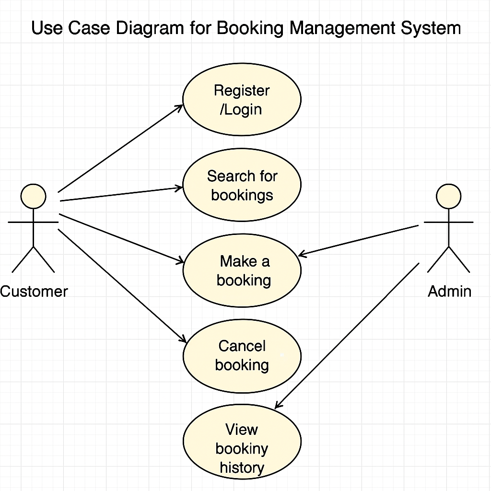

# Requirement Analysis in Software Development

This repository contains a comprehensive breakdown of the Requirement Analysis phase in the Software Development Life Cycle (SDLC). It simulates a real-world scenario through the analysis of a Booking Management System to help learners master requirement gathering, documentation, and validation using industry-standard practices.

## What is Requirement Analysis?

Requirement Analysis is the systematic process of identifying, gathering, analyzing, and documenting the needs and expectations of stakeholders for a software system. This phase acts as a foundation for the entire software development process and ensures that the software product aligns with business objectives and user requirements.

In this phase, developers, business analysts, and stakeholders collaborate to define what the system must do (functional requirements) and how it should perform (non-functional requirements). The process includes gathering information, validating needs, resolving conflicts, and documenting all findings in a structured way such as in a Software Requirements Specification (SRS) document.

---

### Key Goals:
- Clearly understand user and business needs.
- Convert vague business ideas into detailed, actionable software requirements.
- Ensure all stakeholders share a common understanding of the system to be developed.

---

### Role in the SDLC:
Requirement Analysis is typically the first step in the SDLC and is crucial for:
- Defining the **project scope**.
- Establishing the **foundation for design and development**.
- Guiding **testing and validation** efforts.
- Reducing risks, rework, and cost overruns caused by misunderstood or missing requirements.

## Why is Requirement Analysis Important?

Requirement Analysis is a vital component of the software development process because it determines the success or failure of a software project. Here are some key reasons why it is important:

1. **Clarity and Alignment**
   - It ensures that all stakeholders (developers, clients, testers, and users) have a shared understanding of the system.
   - Prevents miscommunication and avoids scope creep.

2. **Foundation for Design and Development**
   - Clear and accurate requirements serve as a blueprint for the system's architecture and design.
   - Helps developers know exactly what to build and testers what to validate.

3. **Cost and Time Efficiency**
   - Identifying requirements and errors early avoids expensive fixes later during development or post-deployment.
   - Reduces the risk of project delays and budget overruns.

4. **Improves Quality and User Satisfaction**
   - Ensures that the final product meets user expectations and business needs.
   - Leads to higher acceptance rates and fewer change requests.

5. **Risk Management**
   - Highlights potential challenges and constraints early in the process, allowing for proactive risk mitigation.

## Key Activities in Requirement Analysis

Requirement Analysis involves several crucial activities that ensure software systems are well-understood, accurately documented, and aligned with user expectations. Here are the five key activities:

- **Requirement Gathering**
  - This is the process of collecting information from stakeholders, end users, and domain experts to understand what the system should do.
  - Techniques include interviews, questionnaires, observations, and document analysis.

- **Requirement Elicitation**
  - Focuses on extracting detailed requirements using structured techniques like brainstorming, prototyping, use case analysis, and workshops.
  - Helps clarify vague or ambiguous needs and identify hidden requirements.

- **Requirement Documentation**
  - Involves organizing and writing down the requirements in a formal and readable format, typically in Software Requirements Specification (SRS) documents.
  - Ensures all team members have a consistent reference.

- **Requirement Analysis and Modeling**
  - Requirements are analyzed for feasibility, completeness, consistency, and traceability.
  - Models like use case diagrams, data flow diagrams, or entity-relationship diagrams are used to visualize and refine requirements.

- **Requirement Validation**
  - Involves reviewing and verifying requirements with stakeholders to ensure they accurately reflect user needs.
  - This prevents costly changes later in the development process and ensures stakeholder agreement.

## Types of Requirements

In software development, requirements are generally categorized into **Functional** and **Non-functional** requirements. Both are essential for building a system that meets user needs and performs reliably.

### Functional Requirements

These define what the system should do — the specific behaviors, features, and functions.

#### Examples for the Booking Management System:
- Users should be able to **register** and **log in** to the system.
- Customers should be able to **search** for available bookings.
- The system should allow users to **make**, **view**, and **cancel** bookings.
- Admin users should be able to **approve or reject** booking requests.
- The system should send **confirmation emails** after successful bookings.
- Users should be able to **view their booking history**.

### Non-functional Requirements

These define how the system performs its tasks rather than what it does.

#### Examples for the Booking Management System:
- The system should respond to user actions **within 2 seconds**.
- The application should be **available 99.9% of the time** (high availability).
- All user data should be **encrypted** and stored securely.
- The platform should support **up to 10,000 concurrent users** without performance issues.
- The system should have a **user-friendly interface** and be accessible on **mobile and desktop devices**.
- The application must comply with **data protection regulations** (e.g., GDPR).

## Use Case Diagrams

Use Case Diagrams are a visual representation of how users (actors) interact with a system to achieve specific goals. They help clarify system functionalities, define user roles, and ensure all interactions are captured early in the development process.

### Benefits of Use Case Diagrams:
- Provide a clear picture of the system's functionality.
- Serve as a communication tool between stakeholders and developers.
- Help identify all user interactions and system boundaries.

Below is a Use Case Diagram for the Booking Management System:

